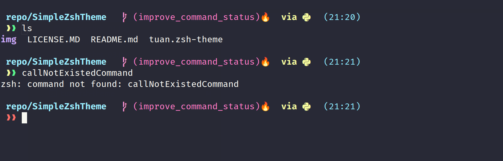

# Tuan.zsh-theme
A simple zsh theme for ***oh-my-zsh***, a.k.a `tuan` theme for short.

This dark theme favors visual clarity and minimalism while is still easy on the eyes and provides a certain amount of necessary information for developers, esp. those who uses Python virtualenv.

## Screenshots
Without Python virtualenv prompt


With Python virtualenv prompt


Prompt indicator changes color after executing a nonexistent command


## Features 

- **Directory**: show current and parent directory up to 1 level. Auto shorten when traversing any directory tree.
- **Git status**: 
    - 🔥 means there is uncommitted change in the current (git) directory. If you use `oh-my-zsh`, git status is evaluated by the [git_prompt_info()](https://github.com/ohmyzsh/ohmyzsh/blob/d87ab251c7fe18626b2d0c4e4a184e7bed7c508b/lib/git.zsh) sub function, which calls the `git status --porcelain` plus other conditioned flags.
    - It is possible to ignore untracked files (so that it won't show 🔥) by enabling the following line in your `.zshrc`: 
        ```zsh
        DISABLE_UNTRACKED_FILES_DIRTY="true"
        ```
- **Clock**: 24-h clock that might come handy. Can be changed to AM/PM format if needed.

### Other Notes
For those who want to replicate exactly the shell appearance in above screenshots, see if you have the same font and terminal theme as below.
- **Font**: FiraCode Nerd Font Retina (See more on the Font requirement below).
- **Terminal emulator**: tilix.
- **Terminal theme**: [Dracula theme](https://github.com/dracula/tilix) for tilix terminal.

## How to Install in Linux

0. Set up your [oh-my-zsh](https://github.com/ohmyzsh/ohmyzsh).
1. Link file `tuan.zsh-theme` to `~/.oh-my-zsh/themes/`
    ```bash
    # Clone this repo
    cd SimpleZshTheme/
    ln -s tuan.zsh-theme  ~/.oh-my-zsh/themes/tuan.zsh-theme
    ```
2. Add/modify your `.zshrc` to add new theme:
    ```bash
    ZSH_THEME="tuan" 
    ```
3. Enable UTF-8 for correct display of special characters in your .zshrc:
    ```bash
    # add following lines in your .zshrc
    export LC_ALL=en_US.UTF-8
    export LANG=en_US.UTF-8
    ```
3. Recommended plugins for oh-my-zsh:
    ```bash
    # in your .zshrc
    plugins=(git   # mush have
            python
            please # if you use please build system
            aliases
            copypath
            zsh-autosuggestions # must have
            # zsh-syntax-highlighting # good to have, see below note        
    )

    ```
    On `zsh-syntax-highlighting`: (***feel free to skip*** if you are not using this plugin) I would highly recommend disabling the syntax underlining. It can be done by adding the following lines into your .zshrc:
    ```bash
    # Disable underlining for zsh-syntax-highlighting plugin
    (( ${+ZSH_HIGHLIGHT_STYLES} )) || typeset -A ZSH_HIGHLIGHT_STYLES
    ZSH_HIGHLIGHT_STYLES[path]=none
    ZSH_HIGHLIGHT_STYLES[path_prefix]=none
    ``` 

## Requirements:

- Oh-my-zsh installed in your system. [oh-my-zsh](https://github.com/ohmyzsh/ohmyzsh) github provides very clear and straightforward instructions on how to install and use.
- A Nerd Font installed in your machine, e.g. Fira Code Nerd Font ([website](https://www.nerdfonts.com/font-downloads)). This is required to render some of the fonts and icons properly. If you see weird characters displayed on your terminal, there is a high chance that you haven't installed and chosen the font properly.
    - Choose `FiraCode Nerd Font` in your terminal emulator profile. 
    - Do the same in your VSCode `editor.font` and `terminal.font` settings if you want to use this theme in your VSCode terminal.
- [Optional] Dracula theme for your choice of terminal emulator, e.g. tilix, gnome-terminal, etc., and for VSCode (if you also use VSCode). Refer to Dracula theme [website](https://draculatheme.com/) for installation.

## Notes on Using
1) On autocomplete        
2) On `zsh-syntax-highlighting`: need 

## Credits
- robbyrussell and the oh-my-zsh community.
- ChesterYue for his theme-icon inspiration.
- The Nerd Fonts' authors and community.
- Dracula theme's authors and contributors.
