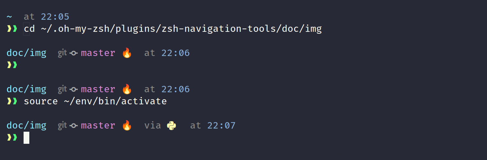

# SimpleZshTheme
A simple zsh theme (for oh-my-zsh), a.k.a `tuan` theme for short.

This theme favors readability and compactness while still looks asthetically appealing (to some extent) and provides a certain amount of necessary information for developers, esp. those who uses Python virtualenv.

## Screenshots
Without Python virtualenv prompt


With Python virtualenv prompt


Prompt indicator changes color after executing a nonexistent command


#### Note in these screenshots:
- Terminal emulator: tilix
- Font: FiraCode Nerd Font Retina (See more on the Font requirement below)
- Theme for terminal (tilix): Dracula theme
- Git status: 
    - 🔥 means there is uncommitted change in the current (git) directory. If you use `oh-my-zsh`, git status is evaluated by the [git_prompt_info()](https://github.com/ohmyzsh/ohmyzsh/blob/d87ab251c7fe18626b2d0c4e4a184e7bed7c508b/lib/git.zsh) sub function, which calls the `git status --porcelain` plus other conditioned flags. ✔ means the opposite.
    - It is possible to ignore untracked files (so that it shows ✔ instead of 🔥) by enabling the following line in your `.zshrc`: 
        ```zsh
        DISABLE_UNTRACKED_FILES_DIRTY="true"
        ```

## How to install (with Oh-my-zsh) in Linux
0. Set up your [oh-my-zsh](https://github.com/ohmyzsh/ohmyzsh).
1. Link file `tuan.zsh-theme` to `~/.oh-my-zsh/themes/`
    ```bash
    # Clone this repo
    cd SimpleZshTheme/
    ln -s tuan.zsh-theme  ~/.oh-my-zsh/themes/tuan.zsh-theme
    ```
2. Add/modify your `.zshrc` to add new theme:
    ```bash
    ZSH_THEME="tuan" 
    ```
3. Optional suggestion: enable `git` plugin
    ```bash
    # in your .zshrc
    plugins=(git
            python 
            aliases
            zsh-autosuggestions
            # ...
        )
    ```

## Requirements:
- Oh-my-zsh installed in your system ([link](https://github.com/ohmyzsh/ohmyzsh)).
- A Nerd Font installed in your machine, e.g. Fira Code Nerd Font ([link](https://www.nerdfonts.com/font-downloads)). Choose `FiraCode Nerd Font` in your terminal emulator profile. Do the same in your VSCode editor.font and terminal.font settings if you want to use this theme in your VSCode terminal.
- [Optional] Dracula theme for your choice of terminal emulator, e.g. tilix, gnome-terminal, etc., and for VSCode (if you also use VSCode). Refer to Dracula theme [website](https://draculatheme.com/) for installation.

## Credits
- robbyrussell and the oh-my-zsh community.
- ChesterYue for his theme-icon inspiration.
- The Nerd Fonts' authors and community.
- Dracula theme's authors and contributors.